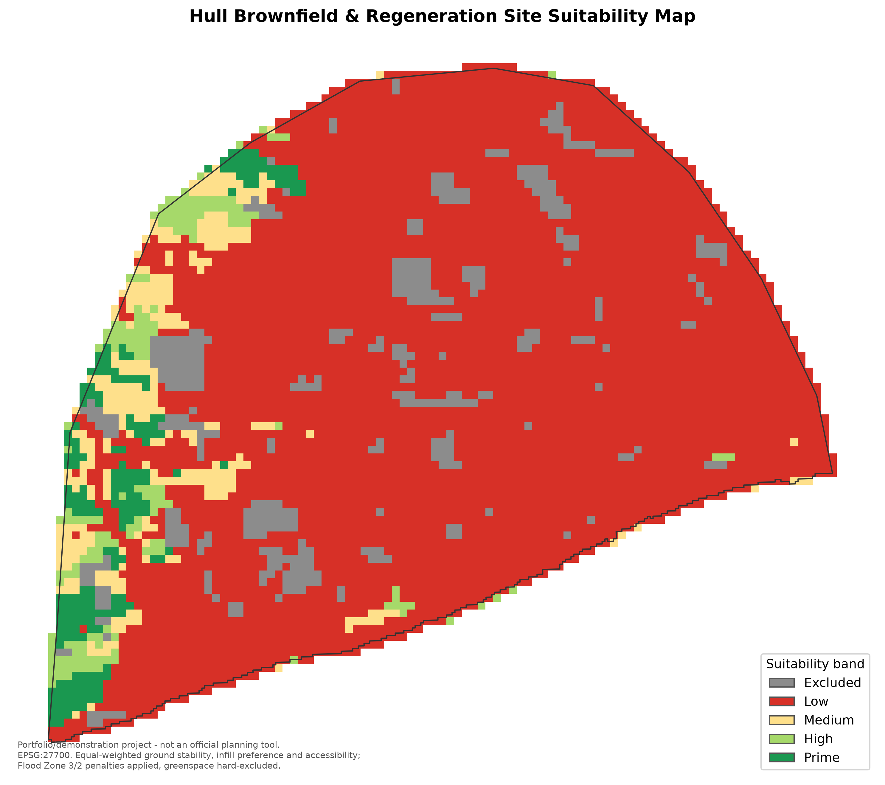

# Hull Brownfield & Regeneration Site Suitability Mapping

A reproducible, transparent decision-support tool for identifying
regeneration-ready land in Hull, UK.



## Problem

Hull City Council's [Council Plan 2024-2028](https://www.hull.gov.uk/) sets out
active regeneration priorities across the city — including the East Bank Urban
Village, Albion Square, the Priority Streets programme, and the wider Hull
Housing Strategy 2023-2030. Identifying which parcels of land are realistically
suitable for redevelopment involves weighing multiple, often competing factors:
ground stability, flood risk, existing development density, and accessibility.

This project builds a **multi-criteria suitability model** that scores areas of
Hull for redevelopment potential and presents the results as an interactive web
map, so the reasoning behind every score is visible and auditable rather than
hidden inside a black-box model.

> **This is a portfolio/demonstration project.** It does not replace statutory
> planning assessment, site surveys, or official council evaluation, and it
> should not be used as the basis for real investment or planning decisions.

## Relationship to other work in this portfolio

This project is deliberately distinct from the author's MSc dissertation, which
modelled surface-water flood vulnerability using machine learning. Here, flood
zone data is used only as an *exclusion/constraint layer* to rule out clearly
unsuitable land — it is not the analytical focus, and no flood vulnerability
modelling methodology from the dissertation is reproduced.

## Methodology

A multi-criteria decision analysis (MCDA), not a machine-learning model:

1. Load and reproject all vector layers to a common CRS (EPSG:27700, British
   National Grid) — see `src/inspect_data.py` / `src/reproject_boundary.py`.
2. Define the unit of analysis: a regular 100m × 100m grid clipped to the
   Hull administrative boundary (`src/grid.py`). No ward-level sub-areas
   were supplied, so a grid is used instead.
3. Derive suitability sub-scores per grid cell (`src/scoring.py`):
   - **Ground stability** — Hull sits on soft alluvial ("warp") superficial
     deposits over a single, uniform chalk bedrock unit, so stability is
     scored from the *superficial* geology class covering most of each cell
     (till = 85, river terrace sand/gravel = 75, alluvium = 30), falling back
     to a fixed chalk bedrock score (70) where nothing superficial is mapped.
   - **Infill preference** — linear distance decay from each cell's centroid
     to the nearest existing building footprint (100 at 0m, 0 at ≥300m),
     favouring redevelopment adjacent to existing urban fabric over
     disconnected greenfield land.
   - **Exclusions / flood treatment** — greenspace is a **hard exclusion**
     (score forced to 0, band = "Excluded") since it's genuinely
     protected/undevelopable land. Flood Zone 3 and Flood Zone 2 are both
     **penalties, not hard exclusions** (×0.2 and ×0.5 on the combined
     score respectively, with FZ3 taking precedence where both apply). A
     literal FZ3 hard exclusion was tried first and rejected: EA Flood Zone
     3 covers ~79% of Hull's administrative area, and hard-excluding it
     flagged both real regeneration sites checked in step 6 below
     (Albion Square, East Bank Urban Village) as "Excluded" — which
     contradicts how development actually proceeds in Hull under the NPPF
     Sequential/Exception Test and the city's tidal defences. The heavy
     penalty keeps flood exposure clearly reflected in the score without
     erasing most of the city from the map.
   - **Accessibility** — linear distance decay from each cell's centroid to
     the nearest *major* road (A Road, B Road or Primary Road, including
     dual-carriageway variants; 100 at 0m, 0 at ≥800m). Ordinary local
     streets are dense almost everywhere in a built-up city like Hull, so
     distance to *any* road wouldn't differentiate cells — proximity to the
     strategic road network is a more meaningful accessibility proxy for
     larger-scale regeneration.
4. Combine sub-scores into a single weighted Suitability Index (0–100)
   (`src/suitability_pipeline.py::WEIGHTS`, applied before the flood penalty
   and greenspace exclusion). All three sub-scores are weighted equally
   (1/3 each) — a deliberate simplification for a demonstration project
   rather than a claim that all three matter equally in reality. A proper
   weighting exercise (e.g. AHP with input from planners/surveyors) would be
   a natural next step beyond this project's scope.
5. Classify each cell into a suitability band: Low (0–25) / Medium (25–50) /
   High (50–75) / Prime (75–100) / Excluded (hard exclusion).
6. Sense-check results against known real regeneration sites. Using
   approximate landmark-level coordinates (not exact site boundaries — see
   caveat below): **East Bank Urban Village** scores in the Low band
   (suitability index ≈ 13.9) rather than "Excluded", showing the flood
   penalty approach works as intended for a site the model previously
   erased entirely — its strong accessibility score (≈84, close to the
   Wincolmlee/Sculcoates arterial roads) and infill preference (≈95) pull
   the index up from what flood exposure alone would give it. **Albion
   Square** still lands in "Excluded" — but because its approximate
   coordinate falls in a 100m cell that is 75% covered by Queen's Gardens, a
   real public park immediately adjacent to the site, not because of flood
   zoning or accessibility. This is an honest limitation of combining a
   coarse 100m grid with a single approximate landmark coordinate rather
   than the site's actual boundary polygon, not a flaw in the exclusion
   logic — the model is correctly detecting genuine parkland in that cell.

## The app

`app/app.py` is a Streamlit web app for exploring the scored grid
interactively — a map of Hull coloured by suitability band (grey =
Excluded, red = Low, yellow = Medium, light green = High, dark green =
Prime), with:

- **Live weight sliders** for the three sub-scores (ground stability,
  infill preference, accessibility) — the Suitability Index recombines in
  real time as you move them, so the reasoning stays visible rather than
  locked inside a black box;
- **click-to-inspect popups** on every grid cell showing its full
  sub-score breakdown (ground stability, infill preference, accessibility,
  flood zone flags, index, band);
- a **band filter** to isolate e.g. only Prime/High cells;
- **toggleable context layers** — Flood Zone 2, Flood Zone 3, greenspace,
  the major road network the accessibility score is based on, and markers
  for the two known regeneration sites used in the face-validity check
  (Albion Square, East Bank Urban Village);
- a **top-scoring cells table** and band-count summary chart.

## Data

All source layers live in `data/raw/` and are pre-clipped to Hull. See
`data/raw/dataset_validation_links.xlsx` for source metadata.

| Layer | Purpose |
|---|---|
| `Building_Hull1.shp` | Building footprints — development density |
| `Administrative boundary_Hull.shp` | Hull administrative boundary |
| `GB_GreenspaceSite_Hull.shp` | Protected green space — exclusion layer |
| `625k_V5_BEDROCK_Geology_Polygons_Hull.shp` | Bedrock geology — ground stability proxy |
| `UK_625k_SUPERFICIAL_Geology_Polygons_Hull.shp` | Superficial geology |
| `Flood_Zones_2_3_Rivers__Hull_Clip.shp` | EA flood zones — exclusion/constraint layer only |
| `Roads_Hall1.shp` | Road network — accessibility scoring |
| `Hist Surface Water Flood Record_Hull.shp`, `HydroNode_Hull.shp`, `WatercourseLink_Hull.shp` | Supplementary hydrology context |

Run `src/inspect_data.py` (see below) to confirm each layer's CRS before any
analysis — one source layer (the administrative boundary) is in WGS84 and
needs reprojecting to EPSG:27700 to match the rest.

## Project structure

```
data/
  raw/          source shapefiles (as supplied)
  processed/    cleaned/reprojected/derived layers (generated, gitignored)
notebooks/      exploratory analysis
src/            reproducible pipeline code
app/            interactive Streamlit web app
outputs/        exported maps and figures
config.py       central file paths and constants (no hardcoded paths elsewhere)
```

## How to run

Requires Python 3.11+.

```bash
python -m venv venv
venv\Scripts\activate          # Windows
# source venv/bin/activate     # macOS/Linux
pip install -r requirements.txt
```

Inspect the raw data (CRS, feature counts, columns) before running the
pipeline:

```bash
python -m src.inspect_data
```

Run the full suitability pipeline (builds the grid, computes sub-scores,
writes the scored grid to `data/processed/suitability_grid_100m.gpkg`):

```bash
python -m src.suitability_pipeline
```

Launch the interactive web app (requires the pipeline to have been run at
least once already, so `data/processed/suitability_grid_100m.gpkg` exists —
see [The app](#the-app) above for what it does):

```bash
streamlit run app/app.py
```

Then open http://localhost:8501 in a browser.

Export static outputs (no server required — writes to `outputs/`):

```bash
python -m src.export_outputs
```

## Outputs

`python -m src.export_outputs` (`src/export_outputs.py`) writes:

- `outputs/figures/suitability_map.png` — the static choropleth shown at the
  top of this README.
- `outputs/figures/band_distribution.png` — a bar chart of cell counts per
  suitability band.
- `outputs/suitability_map.html` — a standalone interactive version of the
  map (same styling as the Streamlit app's default view, including
  click-to-inspect popups) that opens directly in a browser with no server
  needed — useful for sharing the map with someone who just wants to look,
  not run the app.

Both the PNG and the HTML map are built from the same `src/mapping.py`
module the Streamlit app uses, so all three stay visually consistent.

## Status

🚧 Work in progress. Current stage: all four sub-scores (ground stability,
infill preference, accessibility, flood/greenspace exclusion) implemented
and combined into a Suitability Index, an interactive Streamlit app for
exploring the map, and static PNG/HTML exports in `outputs/`.

## Limitations

- This is a demonstration MCDA model with illustrative weights, not a
  validated planning tool.
- Suitability weights reflect the author's judgement, documented for
  transparency, and should be reviewed by a domain expert before any
  real-world use.
- Flood Zone 3 is treated as a heavy score penalty rather than a hard
  exclusion (see Methodology step 3) — a deliberate, documented deviation
  from a stricter reading of the brief, made because Hull's real geography
  (~79% of the city in FZ3) made a hard exclusion fail its own face-validity
  check. This is not a substitute for a full Flood Risk Assessment or the
  statutory Sequential/Exception Test.
- The 100m grid is a modelling simplification; it doesn't align with real
  parcel/plot boundaries, so individual cell scores near a feature's edge
  can be sensitive to exactly where that boundary falls.
- The face-validity spot-check in step 6 uses approximate landmark-level
  coordinates for Albion Square and East Bank Urban Village, not their
  actual site boundaries, so results should be read directionally rather
  than as a precise match.

## License

MIT — see [LICENSE](LICENSE).

## Author

Ayebawanaemi Geraldine Winston — MSc Data Science. Part of a portfolio series;
see also the [surface-water flood vulnerability dissertation
repo](https://github.com/Geraldine-Winston) *(link to be added)*.
